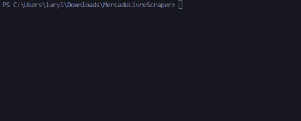

<div align="center">

</div>
<p align="center">
🚀 Uma simples e <i>rápida</i> ferramenta para extrair ofertas do <a href=https://www.mercadolivre.com.br>Mercado Livre</a></p>

<div align="center">


</div>

<p align="center">
 <a href="#sobre">Sobre</a> •
 <a href="#install">Instalação</a> • 
 <a href="#showcase">Showcase</a>
</p>

<h2 align="left" id="sobre">📖 SOBRE</h2>
<p align="left">Com esta ferramenta você será capaz de ter <strong>todos</strong> os produtos e preços das ofertas do Mercado Livre em suas mãos, ou melhor, em um arquivo excel 🤯 quanto poder não é mesmo? São mais de 2000 produtos e tudo isso em um tempo médio de apenas <i>4.5 segundos</i> ⏱️

<h3 align="left">⚡ Como tão rápido?</h3>
<p align="left">Para ser <i>rápida</i> esta ferramenta utiliza o recurso de concorrências(async) do python, assim podendo fazer várias tarefas ao mesmo tempo acelerando <strong>100%</strong> o processo em comparação a um código síncrono. Além de estratégias como renderizar apenas partes relevantes do código HTML e ter um código projetado para ser o mais otimizado possível.</p>

### 📍 Features

- [x] Produtos
- [x] Preços
- [ ] Status do Frete
- [ ] Link


### 📕 Bibliotecas
- [aiohttp](https://docs.aiohttp.org/en/stable/)
- [BeautifulSoup](https://www.crummy.com/software/BeautifulSoup/bs4/doc/)
- [pandas](https://pandas.pydata.org/docs/reference/index.html)


<h2 align="left" id="install">📄 INSTALAÇÃO</h2>
1. Clone o repositório

```bash
git clone https://github.com/eulikceto/OffersScraper
```
2. Entre na pasta

```bash
cd Offer Scraper
```
3. Instale as dependências

```bash
pip install -r requirements.txt
```
4. Rode a ferramenta

```bash
python main.py
```

<h2 align="left" id="showcase">🖥️ SHOWCASE</h2>

